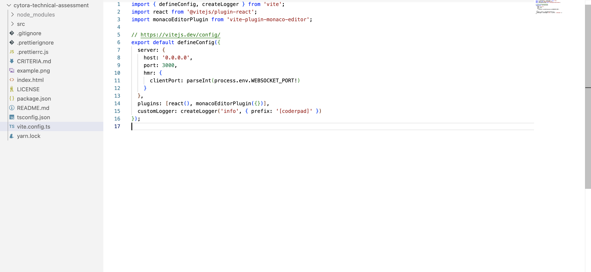

# Cytora Technical Assessment

The objective of this assessment is to create a web based IDE based on a list of File objects. We want to build something like this, which you see in mode IDE environments:



## Task

The path where you can find the file data is here: `src/defaultFiles.ts`. The file data is an array of File objects. Each File object has a `path` and contents `property`.

The `path` is a string that represents the path to the file. The `contents` are a string that represents the contents of the file.

The main goals are required while the secondary goals are optional. We recommend you complete the main goals first before moving on to the secondary goals if time allows. Your solution must:

### Main Goals

1. Show the files in a nested structure, with separate sections for each folder and file.

2. Make sure the application can handle file structures of any complexity.

3. Arrange the file tree in a specific order:

   3.a Folders should be displayed before files.

   3.b All items should be sorted alphabetically, regardless of uppercase or lowercase letters.

4. Any changes you make to file contents must persist for the duration of the session and save automatically. We do not expect the state to maintain after a page refresh but you are more than welcome to implement this if you have time.

5. Write tests for your code, see [this](./CRITERIA.md) file for further guidance.

### Secondary Goals

If you complete the main goals and there is still time remaining:

6. Implement the feature of adding new files and folders to the file tree.

7. Implement the feature of deleting files and folders from the file tree.

8. Implement a feature to move files to a different folder via drag and drop.

9. Being able to have a full-text search in the file pane so you can search for a file by name (not by path).

10. Ability to resize the panels (the file tree and the code editor).

### Evaluation Criteria

#### Technology Requirements

React and Typescript are mandatory requirements. Apart from this, you can use any libraries, task runners and build processors.

**Preinstalled Packages:**

We have included a few packages in the project, but you are free to use any if you prefer:

- monaco-editor (Code Editor)
- @mui/material (Material UI)

You are also free to add any other utility packages you want like eslint etc.

#### Code Requirements

The full criteria for evaluating the coding challenge can be found [here](./CRITERIA.md).

#### Time Limit

The coding challenge does not have a strict time limit, but we recommend allocating approximately **3-4 hours** for completing the essential components of the application. We value the effort you put into the challenge and want to be considerate of your time.

It is advisable to prioritize ensuring that the application functions correctly and includes some tests before proceeding to secondary objectives. Enjoy coding!

##### How To Submit

- Complete your project as described above within your local repository.
- Make sure your application can start, build and run without errors.
- Ensure everything you want to commit is committed before you bundle.
- Create a git bundle: `git bundle create your_name.bundle --all`.
- Email the bundle file to your point of contact.

**To be fair to all candidates, please refrain from sharing your solution on public repository hosting services such as GitHub and Bitbucket. Please see the [license](./LICENSE) for further details.**

## Getting Started

### Prerequisites

Ensure your system has the following installed:

- [Node.js](https://nodejs.org/en/) (v16.18.1 or higher)
- [Yarn](https://yarnpkg.com/) (v1.22.19 or higher)

### Installation

To install the application, run this command in the terminal:

```sh
yarn install
```

### Build

To build the application, run this command in the terminal:

```sh
yarn dev
```

## Helpful Information

This is a React app that is served by Vite. Changes are automatically captured as you type them, and you can add as many files to the project as you need, as well as any NPM packages.

### TypeScript

The app is pre-configured to support TypeScript. Please use it for all your code and ensure there are no type errors.

### IntelliSense

IntelliSense is running across your entire project, allowing you to see when there are syntax errors or to get quick hints for how to resolve errors or TypeScript issues.

### Hot Module Reloading

Vite provides Hot Module Reloading by default, meaning that changes you make to the files in your project are automatically applied (after a 2-second debounce); there is no need to refresh the iframe to see the changes. Vite will display any errors directly in the application output, or if there is a system-wide error, in the Logs.

Note that changes to certain files (index.html, vite.config.ts, and others) will cause the entire application to reload, while changes to other files (App.tsx) will not cause an app to reload. The state of the application will be reset whenever the application reloads.

### Assets

Out-of-the-box support for SVG files is included, just add a `whatever.svg` file and then import it wherever you need it.
